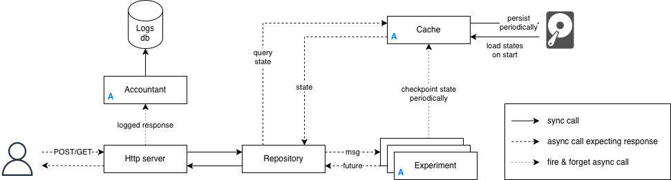

# rust-bandits (WIP)

## About

This is a prototype of a backend application for real-time online experimentation based on multi-armed bandits policies, written in rust. It's like AB testing, but dynamic as it tries to maximize the value while the experiment runs. Common use cases are testing algorithms in an online setting, content and ads optimization and dynamic pricing.

The system is composed of an HTTP server exposing a REST API managing the life cycle of online experiments optimizing for binary rewards - such as clicks or conversions - where different variants of _something_ are exposed to a varying fraction of traffic depending on their historical performance.

While an experiment is running, an external service sends a request to get the current best variant, collects some binary feedback (for instance a click) and then sends another request to update the state of the underlying policy. Eventually, the policy converges to the best performing variant, assuming a relatively stationary environment.

### Architecture



The HTTP server is implemented using [actix-web](https://actix.rs/) framework and the whole application follows an [actor model](https://en.wikipedia.org/wiki/Actor_model) using [actix](https://github.com/actix/actix?tab=readme-ov-file) framework to efficiently handle concurrency and isolate experiments.

In this paradigm, an actor is an independent entity that manages its own state and interacts with its environment - such as other actors - using asynchronous message passing only. Messages received are enqueued and processed sequentially within an actor, avoiding the complexities of lock mechanisms.

In our system, the HTTP server interacts with a **Repository** that is responsible for managing the different experiments. It is not an actor to avoid contention but instead uses a hashmap of experiment addresses, wrapped in a RwLock for concurrent reads and blocking writes. When starting, it will load states of existing policies. We assume the system will be used to access individual actors through message passing (so repository reads), and more rarely addition/deletion of experiments (repository writes).

Each experiment is an actor implementing some policy, handling the optimization. The repository either creates or deletes experiments, or simply dispatch a message to a running experiment. This allows to have low coupling between experiments and to process requests for different experiments in a non blocking way. 

Individual experiments periodically send their state to a **StateStore** actor, that is also persisted to disk for recovery in case of an application crash.

Upon panic, experiments restart is managed by Actix-web **Supervisor**, with a custom logic in `started` method of **Experiment** actor allowing to reload the last known state.

Finally, every request along with the response is processed by a middleware and sent to an **Accountant** actor, responsible for tracking. It interacts with some storage to persist logs (such as a relational database) while not blocking the rest of the application.

## Getting Started

These instructions will get you a copy of the project up and running on your local machine for development and testing purposes. See [deployment](#deployment) for notes on how to deploy the project on a live system.

Install the standard rust toolchain `rustup` to get the compiler and the package manager:

```
curl --proto '=https' --tlsv1.2 -sSf https://sh.rustup.rs | sh
```

### Installing

Clone the repository:

```
git clone git@github.com:clabrugere/rust-bandits.git
```

Cd within the crate and check that everything is fine:

```
cd rust-bandits && cargo check
```

### Launch

```
cargo run
```

By default the HTTP server will listen to requests sent on `localhost:8080`. This is configurable in the `config.toml` file. You can test by sending a ping request:

```
curl --request GET --url http://127.0.0.1:8080/ping
```

## API endpoints

The system currently exposes 12 routes:

| Request 	| Response 	| Description 	|
|---	|---	|---	|
| `GET v1/ping` 	|  	| send a ping request to the server 	|
| `GET v1/list` 	| `{"experiment_ids": [...]}` 	| return the id of all available experiments 	|
| `DELETE v1/clear` 	|  	| delete all experiments 	|
| `POST v1/create` 	| `{"experiment_id": ...}` 	| create a new experiment and return its unique id 	|
| `PUT v1/{experiment_id}/reset` 	|  	| reset the state of the experiment 	|
| `DELETE v1/{experiment_id}/delete` 	|  	| delete an experiment 	|
| `POST v1/{experiment_id}/add_arm` 	| `{"arm_id" : ...}` 	| create a new variant for a given experiment and return its id 	|
| `DELETE v1/{experiment_id}/delete_arm/{arm_id}` 	|  	| delete a given variant for a given experiment 	|
| `GET v1/{experiment_id}/draw` 	| `{"arm_id" : ...}` 	| get the current best performing variant of an experiment 	|
| `POST v1/{experiment_id}/update` 	|  	| update an experiment by sending a json with structure `{"ts": ...,"arm_id": ...,"reward":...}` 	|
| `POST v1/{experiment_id}/update_batch` 	|  	| send multiple updates for an experiment, with structure `{"updates": [...]}` 	|
| `GET v1/{experiment_id}/stats` 	| `{"arms": {"arm_id": {"pulls": ..., "mean_reward": ...}, ...}}` 	| return some basic stats for a given experiment 	|

## Roadmap

**Core**
- [x] Implement the restart of unresponsive experiments
- [ ] Implement storage for logs and its interactions with the accountant actor
- [x] Create routes to disable/enable arms
- [ ] Improve StateStore persistence to allow for some historization
- [ ] Implement metrics collection system to monitor the service
- [ ] Improve error handling

**Policies**
- [x] Optional epsilon decay
- [x] UCB
- [x] Thomson Sampling for binary rewards (Beta prior)
- [ ] Decayed rewards for non stationary environments
- [ ] Contextual bandits

**UX**
- [ ] Dashboard to manage and monitor experiments: variant selection rates, rewards, etc.